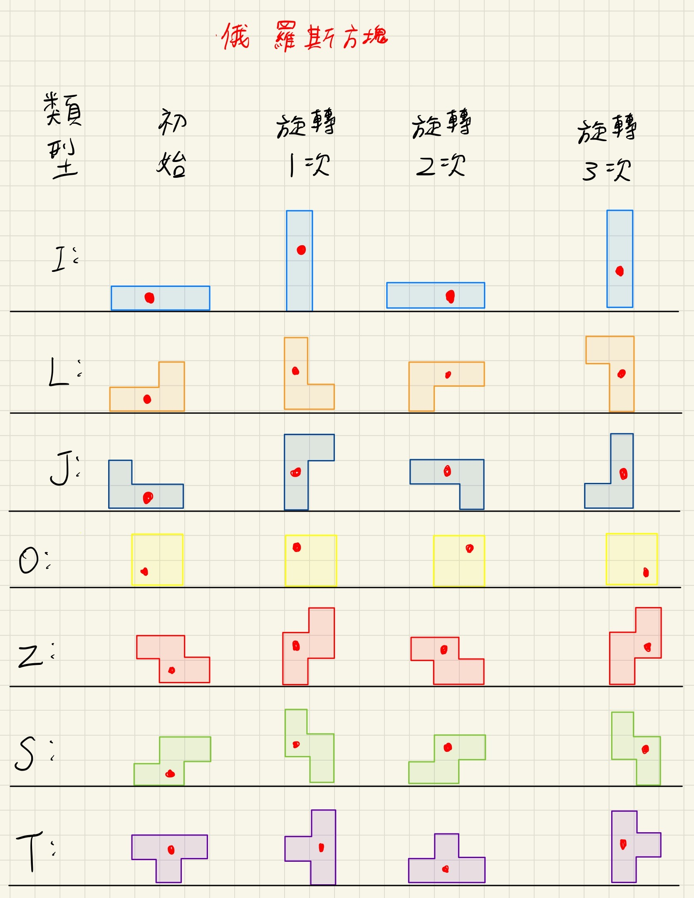

前置準備:

    git設置:
        
	下載git:https://git-scm.com，創個帳號

	給我你github的username，我邀你進git協作。(去信箱接受邀請)

	看你習慣放哪，執行"git clone https://github.com/dkdoeoeo/Tetris.git"
    
    環境設置:

	我自己是用visual studio code，去官網下載

	開啟visual studio code後，選open folder，開啟你剛載的專案資料夾

	前端:

	    點開"./tetris-client/src/App.vue"，也會自動問你要不要載vue

	    下載node.js後重開電腦。https://nodejs.org/zh-tw

		cd 到 ./tetris-client

	    嘗試執行"node -v"、"npm -v"。
	    
    	    如果報錯已停用指令碼執行，以系統管理員身分執行PowerShell，執行:"Set-ExecutionPolicy RemoteSigned"後輸入y

	    執行"npm install"

	    安裝插件:
			vue router: 
				"npm install vue-router@4" 
			tailwind:
				"npm install -D tailwindcss@latest postcss@latest autoprefixer@latest"
			pinia:
				"npm install pinia"
			sass: 
				"npm install -g sass"
			iconify:
				"npm install --save-dev @iconify/vue"
		
		到這邊應該可以執行"npm run dev"來讓前端跑起來了

	
	GO:

   	    點開"./tetris-sever/main/main.go"會自動問你要不要載GO，載就對了。
	
	    然後跟你說找不到路徑，要先去GO官網載。https://go.dev/dl/

	    重啟visual studio code按F5執行main.go十，再載一次應該就可以GO了

	有其他問題再問我或是gpt

前端:

    主要任務:

	1.根據玩家點擊的遊戲選項(單人、雙人、排行榜、設定)跳轉頁面
    
        2.單人、雙人模式讀取玩家鍵盤輸入，傳到後端伺服器。

        3.單人、雙人模式接收後端傳來的遊戲狀態，更新網頁顯示

	4.排行榜接收後端訊息顯示排名(先擱置)

	5.設定可以改音量、鍵位等

    訊息傳送格式:

	ex:左移
 	{
	    "player" : 1
	    "move" : "left"
	}

    待做事項:
	
	雙人模式:

		根據傳入的[20][10] int畫出兩個玩家的畫面。
	
		顯示分數格

		顯示垃圾行計量條

		顯示暫存方塊、下一個方塊
	
	設定:

		修改音量、鍵位
後端:

    主要任務:
    
        1.接收前端訊息，計算遊戲狀態並回傳

    訊息傳送格式:

	一開始分配Player編號:
	{
	    PlayerID int `json:"player_id"`
	}
	
	後續更新的遊戲狀態
	{ 	//[0]:玩家1、[1]:玩家2
	    Player_Block_Board          [2][20][10]int
		PlayerScore                 [2]int
		Player_garbage_line         [2]int
		Player_cur_block_type       [2]string
		Player_cur_block            [2]TetrisBlock
		Player_Hold_Block_type      [2]string
		Player_Next_Block           [2]string
		Player_Eliminate_rows       [2][20]int
		Player_This_Round_Hold_flag [2]bool
		ifGameOver                  int //0遊戲繼續、1玩家一獲勝、2玩家二獲勝
	}

    待做事項:
	
	插入垃圾行

	測試整體功能
	
定義:

    GameState [20][10] int 內數字意義

    0:無方塊

    1:I型方塊(淺藍色)

    2:O型方塊(黃色)

    3:T型方塊(紫色)

    4:S型方塊(紅色)

    5:Z型方塊(綠色)

    6:L型方塊(深藍色)

    7:J型方塊(橘色)

    8:垃圾行(灰色)

    玩家操作種類:
	"left"
	"right"
	"rotate"
	"soft_drop"
	"hard_drop"
	"hold"

